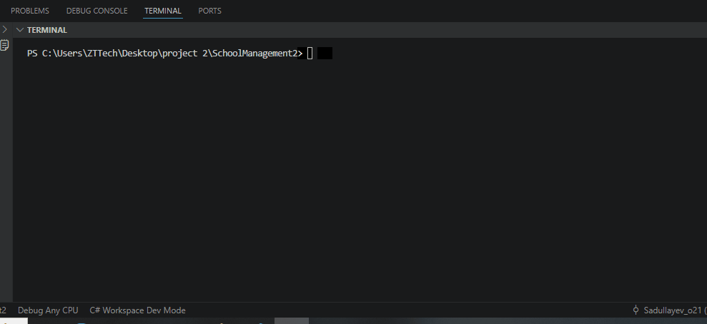
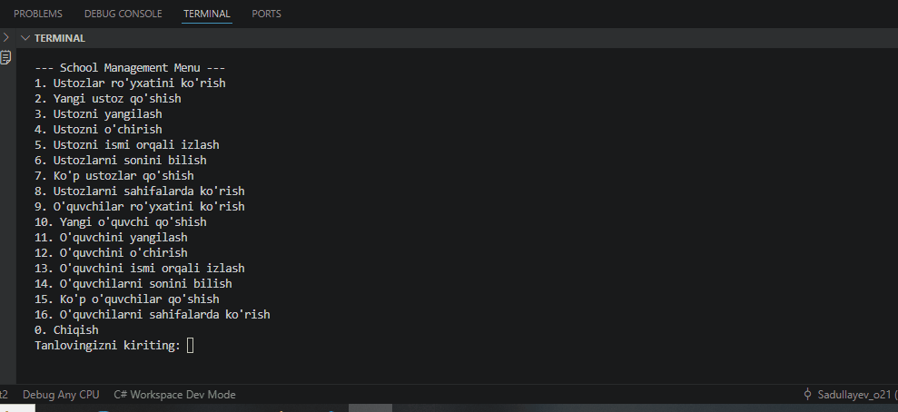
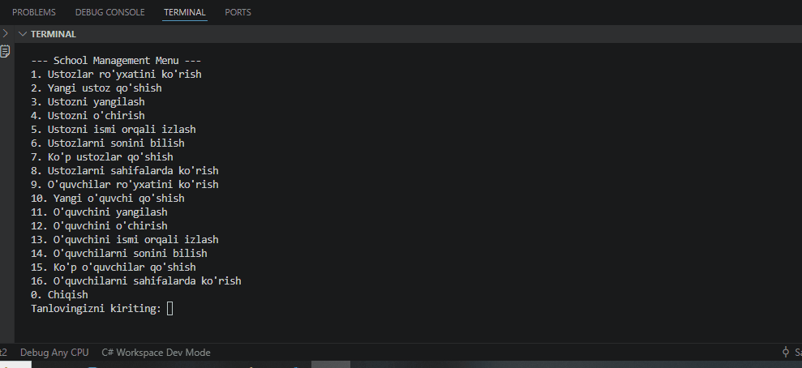
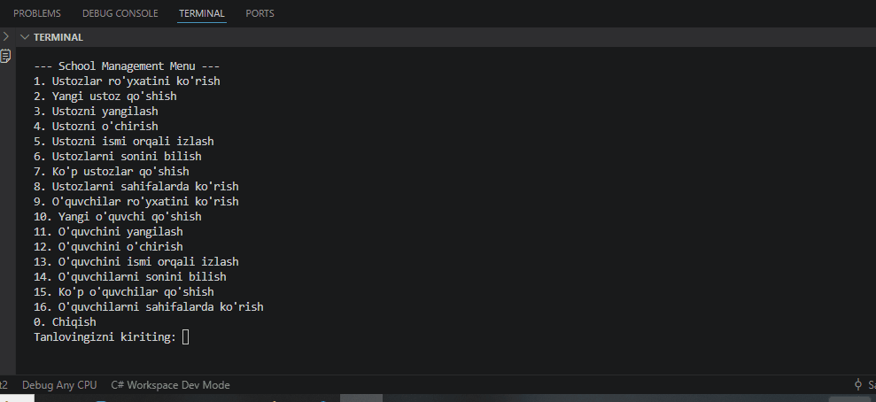

# SchoolManagement

## 📖 About
SchoolManagement — bu C# Console Application bo‘lib, o‘quvchilar ma'lumotlarini boshqarish uchun yaratilgan loyiha.

## ✨ Features
- O‘quvchi qo‘shish
- Barcha o‘quvchilarni ko‘rish
- ID bo‘yicha qidirish
- Ism bo‘yicha qidirish
- Ma'lumotlarni yangilash
- O‘quvchini o‘chirish
- Bir nechta o‘quvchini bir vaqtda qo‘shish
- O‘quvchilar sonini ko‘rish
- Pagination (sahifalab chiqarish)

## Preview
- Ustozlar ro'yxatini ko'rish

- Yangi ustoz qo'shish

- Ustozni yangilash

- Ustozni o'chirish

- Ustozni ismi orqali izlash

- Ustozlarni sonini bilish

- Ko'p ustozlar qo'shish

- Ustozlarni sahifalarda ko'rish

## 🛠️ Technologies
- C#
- .NET
- Console Application

## ▶️ Run
bash dotnet run 

## 👨‍💻 Author
Muhammadziyo Sadul